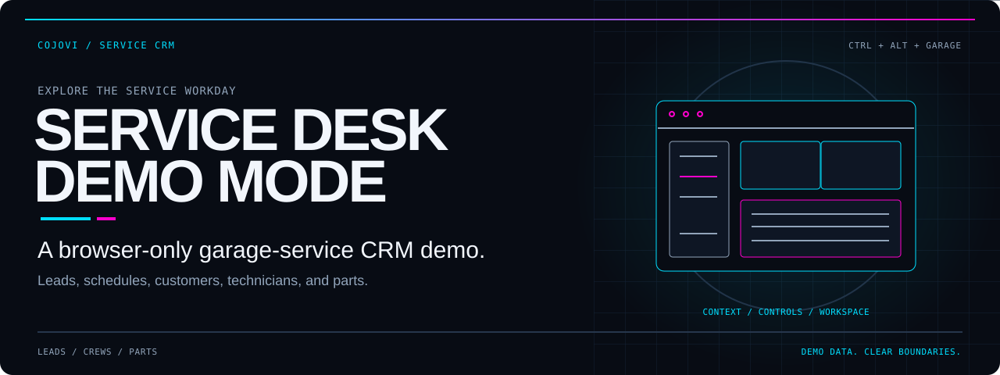
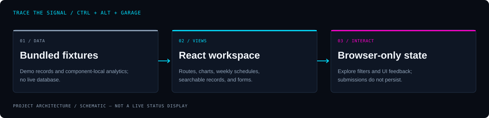

<!-- COJOVI / SIGNAL — ctrl_crm edition -->
<a name="top"></a>

<p align="center">
  
</p>

<h1 align="center">Ctrl + Alt + Garage</h1>

<p align="center">
  <strong>A garage-service workday, in one interactive CRM demo.</strong><br />
  Explore leads, customers, technicians, appointments, and parts through a browser-only workspace.<br />
  Built for interface review and workflow exploration—not live service operations.
</p>

<p align="center">
  
</p>

<p align="center">
  <a href="#overview">Overview</a> ·
  <a href="#architecture">Architecture</a> ·
  <a href="#quickstart">Quickstart</a> ·
  <a href="#configuration">Configuration</a> ·
  <a href="#usage">Explore</a> ·
  <a href="#validation">Validation</a> ·
  <a href="#source">Source</a>
</p>

<a name="overview"></a>
## `> service_overview`

`ctrl_crm` is a React and TypeScript single-page application for a garage-door service business.
Its screens combine searchable records, weekly scheduling, inventory summaries, charts, and form prototypes.
The current implementation runs on bundled demo fixtures rather than a hosted CRM backend.

| Area | What you can explore | Current boundary |
| :--- | :--- | :--- |
| Dashboard | Revenue charts, summary cards, analytics, and report views | Figures are fixture-based, not live telemetry |
| Leads | Search, detail pages, activity timelines, and quote calculations | Create/send actions do not persist or deliver records |
| Customers | Search, status filters, sorting, and history views | Bundled records; no database CRUD |
| Technicians | Skills, availability, ratings, and profile views | No live location or dispatch service |
| Schedule | Week navigation, technician filtering, and an appointment form | Submitting does not add an appointment to the calendar |
| Inventory | Search, low-stock views, and category totals | No stock mutation or purchase-order integration |
| Notifications | Filtering, mark-as-read, and dismissal | Changes remain in component memory |
| Settings | Company, hours, notification, and preference controls | Save feedback is not durable configuration |

> **Demo boundary:** sign-in is checked entirely in the browser against embedded demo values.
> The route guard is a navigation convenience, not a security boundary.
> Do not enter real credentials, customer details, payment data, or operational secrets.

<a name="architecture"></a>
## `> browser_pipeline`

<p align="center">
  
</p>

The diagram shows the current data path—not a cloud deployment:

1. **Fixture data** in [`src/data/demo.ts`](src/data/demo.ts) supplies records and summary values. Analytics and reports also contain component-local fixtures.
2. **React views** in [`src/App.tsx`](src/App.tsx) use React Router, shared UI components, Recharts, and date-fns to present the workspace.
3. **Browser interactions** update view state, filter records, or demonstrate forms. There is no active backend client or server API in this source tree.

[`AuthProvider`](src/components/auth/auth-provider.tsx) restores a serialized demo user from `sessionStorage`.
Signing out clears that tab's demo session; it does not contact an identity provider.
React Hook Form and Zod handle form validation, but validation does not make a form persistent.

The retained [`Supabase migration`](supabase/migrations/20250523152430_spring_leaf.sql) and
[`database types`](src/types/supabase.ts) are legacy artifacts, not a required setup step.
No Supabase client package, connection loader, or active database calls are wired into the demo.

<a name="quickstart"></a>
## `> local_preview`

### Prepare a local checkout

Use a maintained Node.js release compatible with the locked Vite version and npm;
the repository does not pin a Node/npm toolchain.

```bash
git clone https://github.com/cojovi/ctrl_crm.git
cd ctrl_crm
npm ci
npm run dev -- --host 127.0.0.1
```

Open the loopback address printed by Vite. The manifest and lockfile agree on their root dependency declarations.
Dependency installation and these application commands are instructions for a local review, not steps performed for this documentation package.

### Enter the demo

- Obtain the demo access details from the repository maintainer through an appropriate private channel; they are deliberately not reproduced here.
- Use only the project's demo sign-in, never a real account password.
- Start at `/dashboard`, then use the sidebar to explore the service workflow.
- Keep the development server on loopback. Do not treat the login screen as protection for a public deployment.

### Available project commands

```bash
npm run lint
npm run build
npm run preview -- --host 127.0.0.1
```

`build` runs `tsc -b` before `vite build`; `preview` serves the resulting build and requires that build to succeed first.
The project has no `test` script. Review build/lint results before making any deployability claim.
Application builds/tests were not run for this documentation work.

<a name="configuration"></a>
## `> demo_configuration`

| Concern | Source | What to know |
| :--- | :--- | :--- |
| Environment | Current client source | No environment variables or backend keys are required by the demo |
| Authentication | `auth-provider.tsx` | Embedded browser-side comparison; not production authentication |
| Session | Browser `sessionStorage` | Holds the demo user for the tab; no server-side validation |
| Fixtures | `src/data/demo.ts` | Main records and current-week schedule generation |
| Presentation | `src/App.tsx` | Forces the dark theme |
| UI and aliases | `components.json`, `vite.config.ts` | Shared component conventions and `@` source alias |
| Legacy schema | `supabase/migrations/` | Retained for reference; do not apply it to preview the UI |

The settings screen is part of the prototype. Its API-key-looking field is a read-only display,
not a loaded connection secret; notification toggles do not configure email or SMS delivery.
Changing an on-screen setting does not update a backend or a configuration file.

If you adapt fixtures, use clearly synthetic data. Bundled source values are visible to anyone who can load the application.
Do not add private data simply because it sits behind a client-side route guard.

<a name="usage"></a>
## `> explore_the_demo`

### Follow the workday

1. **Review the dashboard** for the summary cards, overview, analytics, reports, notifications, technician, and customer panels.
2. **Open Leads** at `/leads`. Search records, open a detail view, and inspect its timeline or quote form.
3. **Check the week** at `/schedule`. Change weeks and use technician filters; fixture appointments are generated for the week when the data module loads.
4. **Browse the directory** at `/customers` and `/technicians`. Search and filter the supplied profiles without assuming the displayed activity is live.
5. **Review parts** at `/inventory`. Compare stock status and category summaries; the low-stock view is based on fixture quantities and reorder points.
6. **Try settings** at `/settings` to review the control layout, then sign out from the avatar menu.

### Understand the feedback

- Creating a lead validates the form, logs its values, shows a toast, and navigates back; it does not append to the fixture list.
- Creating an appointment logs the values, shows a toast, and closes the dialog; it does not reserve time or notify a technician.
- Sending a quote logs its items and calculated totals and shows a toast; no email, PDF, or saved quote is produced.
- Report export currently logs an action instead of downloading a report.
- Notification read/dismiss actions update local component state. Reloading the application restores its fixtures.
- Some visible buttons are presentation-only. Treat a success message as UI feedback, not evidence of a completed service operation.

<a name="validation"></a>
## `> review_checklist`

Before presenting a local demo:

- [ ] Install from the lockfile and record the Node/npm versions used.
- [ ] Run lint and the TypeScript/Vite build; resolve failures before relying on the preview.
- [ ] Verify sign-in, sign-out, and protected-route redirects with demo credentials only.
- [ ] Review lead search, customer filtering, technician filtering, and inventory tabs.
- [ ] Check calendar behavior across week boundaries and confirm forms do not persist changes.
- [ ] Check dialogs, tables, charts, and navigation at narrow viewport widths.
- [ ] Confirm screenshots and recordings contain no real contact details or operational secrets.

Before developing a live CRM, replace browser-only authentication, add durable storage and server authorization,
implement real write/delivery/export behavior, and create automated tests.
The legacy migration is not a ready-made multi-tenant security model: its policies need a separate design review.

<a name="source"></a>
## `> source_map`

| Path | Responsibility |
| :--- | :--- |
| [`package.json`](package.json) | Dependencies and dev/build/lint/preview scripts |
| [`src/main.tsx`](src/main.tsx) | React entrypoint |
| [`src/App.tsx`](src/App.tsx) | Providers, route graph, and forced theme |
| [`src/components/auth/`](src/components/auth/) | Browser-only session and route guard |
| [`src/data/demo.ts`](src/data/demo.ts) | Shared fixture records and derived totals |
| [`src/components/dashboard/`](src/components/dashboard/) | Dashboard panels, analytics, and reports |
| [`src/components/leads/`](src/components/leads/) | Lead list, detail, timeline, and form prototypes |
| [`src/components/schedule/`](src/components/schedule/) | Weekly view and appointment form |
| [`src/components/inventory/`](src/components/inventory/) | Parts table, stock status, and category summaries |
| [`src/components/ui/`](src/components/ui/) | Shared Radix-based UI primitives |
| [`supabase/migrations/`](supabase/migrations/) | Inactive database schema reference |

## `> ownership_and_scope`

This package documents `cojovi/ctrl_crm`, whose application identity is **Ctrl + Alt + Garage**.
The repository is not marked as a fork. No root license file or package license declaration is present;
ask the owner about reuse rights rather than assuming an open-source license.

No GitHub Actions workflows are tracked in the audited source tree. That does not establish whether external hosting integrations exist.
This README is documentation—not a security certification or a production-readiness claim.

<p align="center">
  
</p>

<p align="center">
  <strong>COJOVI / SIGNAL</strong><br />
  Service workflows. Clear demo boundaries.<br />
  <sub>A <a href="https://github.com/cojovi">Cody / cojovi</a> project · <a href="https://cojovi.com">cojovi.com</a></sub><br />
  <a href="#top">Back to top ↑</a>
</p>
